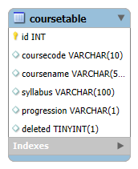

# Kurswebbsida 

En webbsida skapad för att användare ska kunna se kurser i Webbutveckling programmet med möjlighet att addera, radera, och återställa kurser.

## Krav
- Node.js 
- MySQL

## Skapa databas 
1. Skapa en databas som heter `courses`
2. Använd följande tabellstruktur i MySQL:

```sql
CREATE TABLE coursetable (
  id INT NOT NULL AUTO_INCREMENT,
  coursecode VARCHAR(10) NOT NULL,
  coursename VARCHAR(50) NOT NULL,
  progression VARCHAR(1) NOT NULL,
  syllabus VARCHAR(100) NOT NULL,
  deleted BOOLEAN DEFAULT false,
  PRIMARY KEY (id)
);
```

3. Skapa en `.env` fil med din MySQL användarnamn & lösenord.

## ER-Diagram 
Visar tabellstrukturen samt fält för kursid, kursnamn, kursplan och progression tilsammans med id-kolumn vilket är primärnyckeln och en soft-delete markör som tar bort kursinfo från frontend sidan utan att radera det från servern/backend sidan.




## Att köra appen 

- `npm run dev` startar backend
- `npm run frontend` startar frontend och startar webbsidan
- `npm run scss` kompilerar scss till css


Gå till [http://localhost:3002](http://localhost:3002) i din webbläsare.


## Filstruktur
```
projekt-root/
├── dist/              # Kompilerade frontend HTML/CSS/JS
├── src/               # Source TypeScript + SCSS
├── server.js          # Express backend
├── .env               # Dina databasuppgifter
├── .env.example       # Exempel uppgifter
├── bs-config.json
├── ER-Diagram.png
├── package-lock.json
├── package.json
├── tsconfig.json
└── README.md
```
